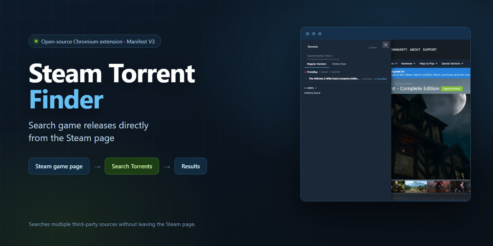
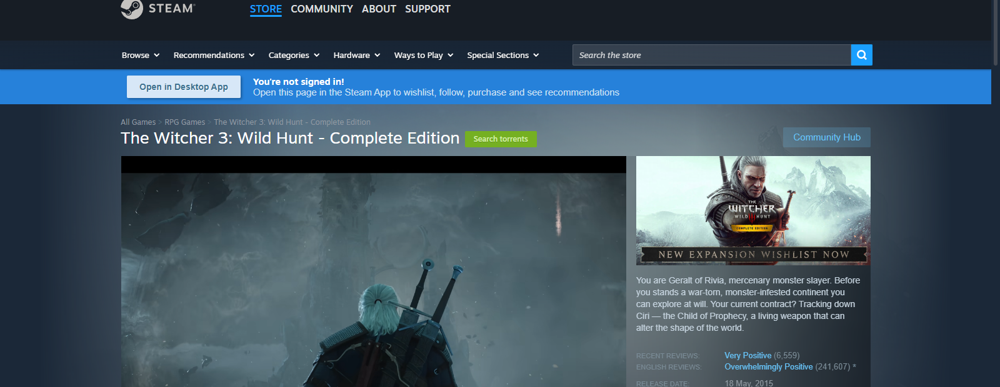
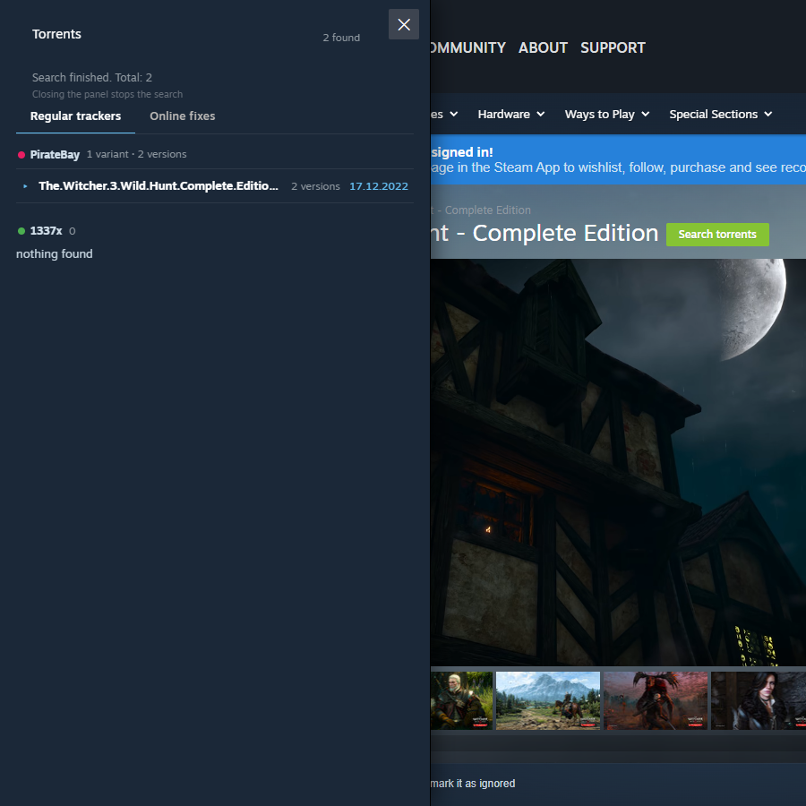
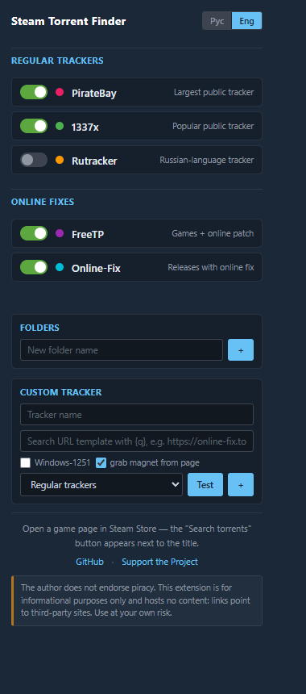
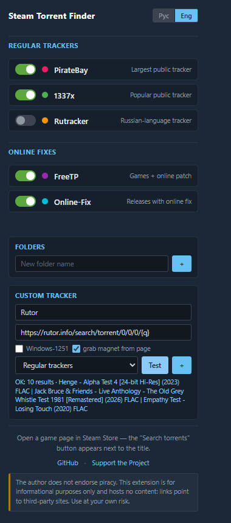

# Steam Torrent Finder

**Search game releases directly from the Steam game page.**

[](#installation)
[](RELEASE_NOTES.md)
[](tests/run.js)
[](#installation)
[](#installation)

<p align="center">
  
</p>

**Steam Torrent Finder** is a lightweight, open-source Chromium extension (Manifest V3) that adds a **Search torrents** button to every Steam game page. One click opens a side panel that queries multiple sources in parallel and streams results as they arrive — without leaving the Steam store.

- Built-in sources: PirateBay, 1337x, Rutracker, FreeTP, Online-Fix
- Custom trackers: add any search page with a `{q}` template and test it right from the popup
- RU / EN interface
- Security-conscious parsing: strict magnet/URL validation, HTML escaping, cookie whitelist
- No telemetry, no accounts, no middleman server — requests go straight from your browser to the sources

> The extension does not host or distribute content. It only searches third-party websites you have enabled and shows the links they return.

---

## Features

- **Search from the Steam game page** — a button is injected next to the game title on `store.steampowered.com/app/*` pages.
- **Streaming results** — each source reports as soon as it answers; you see results appear one by one instead of waiting for the slowest tracker.
- **5 built-in sources** — public trackers and Russian online-fix sites, including full magnet links where available.
- **Custom trackers** — add any site whose search page can be expressed as a URL with `{q}`. A built-in **Test** button shows what the parser extracts before you save.
- **Folders & tabs** — group your sources (default: *Regular trackers* / *Online fixes*), create, reorder, drag trackers between folders.
- **Toggle sources** — enable or disable any tracker or group at any time.
- **Relevance filtering** — results are scored against the game title, junk categories are filtered out, and versions of the same release are grouped into an accordion.
- **Rich result rows** — title, seeds/leeches, size, date, and an action: magnet link or open the release page.
- **Rutracker login-aware** — if you are logged into rutracker.org in the same browser, the extension uses your session; otherwise it offers a plain link to the site's search.
- **RU / EN interface** — switch language in the popup; the Steam panel follows.
- **Defensive parsing** — malformed pages are treated as errors (retried or reported), honest "nothing found" pages are not retried.
- **Auto-recovery on Steam** — the button survives Steam's SPA navigation and page redraws.

---

## Built-in Sources

| Source | Type | Default | Notes |
| ------ | ---- | ------- | ----- |
| **PirateBay** | Public tracker (magnet links) | Enabled | Several HTML mirrors with failover, plus a JSON API fallback. Category-aware ranking, junk filtering. |
| **1337x** | Public tracker (magnet links) | Enabled | Searches the Games category first, then the general search. Magnets are fetched from result pages. |
| **Rutracker** | Russian tracker (magnet links) | Disabled | Requires you to be logged into rutracker.org in the same browser. Falls back to an "open search" link when not logged in. Off by default. |
| **FreeTP** | Online-fix release pages | Enabled | Russian. Returns release pages (game + online patch), not direct magnets — the action opens the release page. |
| **Online-Fix** | Online-fix release pages | Enabled | Russian. Release pages with online-fix patches; opens the source page. |

Sources change their HTML over time; parsers are maintained in `background.js` and are covered by unit tests.

---

## Custom Trackers

Any website whose search results page fits a simple pattern can be added as a custom tracker:

1. Open the extension popup → **Custom tracker**.
2. Paste a search URL and replace the search term with **`{q}`**, for example:
   `https://rutor.info/search/torrent/0/0/0/{q}`
3. Optionally enable **Windows-1251** for old Russian sites, and **grab magnet from release pages** to fetch magnet links from the top result pages.
4. Press **Test** — the extension performs one search request with the test query and shows up to 3 extracted titles, or an error.
5. Press **+** to save the tracker into a folder of your choice.

Details, limitations and examples: **[docs/CUSTOM_TRACKERS.md](docs/CUSTOM_TRACKERS.md)**.

**Good to know:**

- `{q}` is replaced with the URL-encoded game name at search time.
- The parser follows plain `<a href>` links on the results page; relative links are resolved and only same-origin links are accepted.
- The **Test** button performs a single request, without retries and **without cookies**.
- Sites that render results with JavaScript, use POST search forms, or hide links behind anti-bot protection will not work as custom trackers.
- Third-party HTML can change at any moment — a custom tracker may stop finding results without any update on our side.

---

## Screenshots

> All screenshots below are real captures of the extension running in Chromium on live Steam pages.

| | |
|---|---|
|  |  |
| Search button on the Steam game page | Results stream in per source |
|  |  |
| Popup: sources, folders, RU/EN | Custom tracker with `{q}` template and live Test |

---

## How it works

```
Steam game page  (store.steampowered.com/app/*)
        │
        ▼
Content script — injects the button, renders the results panel
        │  runtime.connect (streaming port)
        ▼
Background service worker — queries enabled sources in parallel
        │
        ▼
Sources — search pages, mirrors, small JSON APIs
        │
        ▼
Parsing & validation — magnet format, URL whitelist, escaping, relevance scoring
        │  streamed messages (one per source)
        ▼
UI — incremental results, grouped by source and version
```

Everything runs locally in your browser. There is no backend, no analytics and no proxy: the extension fetches the same pages your browser would fetch if you opened the search URL manually.

---

## Installation

The extension is not published on the Chrome Web Store. Install it manually in developer mode:

1. Download or clone this repository:
   ```bash
   git clone https://github.com/Ga4iGnida/Steam-Torrent-Finder.git
   ```
2. Open `chrome://extensions` in Chrome (or `edge://extensions` in Edge/Brave).
3. Enable **Developer mode** (top right).
4. Click **Load unpacked** and select the extension directory (the folder containing `manifest.json`).
5. Open any Steam game page, e.g. `https://store.steampowered.com/app/292030/`.
6. Click the green **Search torrents** button next to the game title.

Requirements: any Chromium-based desktop browser with Manifest V3 support (Chrome, Edge, Brave, etc.). Developed and tested with Google Chrome.

To update: `git pull`, then press the reload icon for the extension on `chrome://extensions`.

---

## Security

The extension has to parse HTML from sites it does not control. The following measures are implemented in the codebase (they are also covered by unit tests):

- **Magnet validation** — only syntactically valid `magnet:?xt=urn:btih:…` links with a 40-hex, 64-hex or 32-char base32 hash are rendered; anything else, including values smuggled through HTML entities, is dropped.
- **URL validation** — detail links are restricted to `http:` / `https:`. `javascript:`, `data:`, `file:` and protocol-relative tricks are rejected.
- **HTML escaping** — every string taken from a third-party page (titles, sizes, dates, URLs) is escaped before it is inserted into the panel DOM.
- **Defensive parsing** — parsers distinguish "the site honestly returned nothing" from "the page layout is unrecognized". Unknown layouts are retried and reported as errors instead of silently producing wrong results.
- **Cookie / credentials whitelist** — cookies are only attached to `rutracker.org`, `freetp.org` and `online-fix.me` (exact hostname match). All other requests, including **all custom trackers**, are sent with `credentials: 'omit'`.
- **Same-origin filtering for custom trackers** — links found on a custom tracker's results page are resolved against the base URL; only same-origin `http(s)` links become results.
- **Test requests are isolated** — the **Test** button performs one request, without retries and without cookies.

The extension uses validation and defensive parsing when handling third-party tracker data. It cannot make third-party websites trustworthy — treat every source, built-in or custom, the same way you would treat it in a normal browser tab.

---

## Privacy

**What the extension stores**

- Your settings (enabled sources, folders, custom trackers, language) via `chrome.storage.sync`. If you use browser sync, these settings may be synced by your browser like any other extension settings.

**What the extension never does**

- No telemetry, analytics, tracking pixels or "phone home" requests.
- No accounts, no server infrastructure, no proxy through a third party.
- No history of your searches is stored or transmitted.
- Custom trackers never receive your cookies.

**What happens when you click "Search torrents"**

- The background service worker sends requests to the search pages of the sources you enabled (their domains, e.g. PirateBay mirrors, `1337x.la`, `rutracker.org`, `freetp.org`, `online-fix.me`), and — for some sources — to individual result pages to fetch magnet links.
- Cookies are attached only for the three whitelisted hosts above; everything else is sent anonymously from the extension's perspective (`credentials: 'omit'`).
- Requests come directly from your browser and your IP address, exactly as if you opened those pages yourself. The extension does not hide your IP and does not bypass regional blocks.

**Permissions**

| Permission | Why it is needed |
| ---------- | ---------------- |
| `storage` | Save your settings, folders, custom trackers and language. |
| `activeTab` | Interact with the Steam page you already have open. |
| `<all_urls>` (host permissions) | Query tracker search pages and, optionally, arbitrary sites you add as custom trackers. The extension only contacts sources you have enabled. |

---

## Limitations

This is an honest list — please read it before reporting a bug:

- **Third-party markup changes.** Sources update their sites; when they do, a parser can stop working until it is updated.
- **Sources can be unavailable.** Trackers go down, rate-limit, or are blocked by your ISP/region. Some may require a VPN depending on where you live.
- **Rutracker requires a session.** Full results need you to be logged into rutracker.org in the same browser. Without a session you get a fallback search link instead.
- **Custom trackers depend on the target site.** Only plain server-rendered search pages work. JavaScript-rendered results, POST forms, CAPTCHA walls and obfuscated markup will not.
- **Nothing found is usually genuine.** If a source honestly reports "no results", the extension does not retry it — the game may simply not be indexed there.
- **Timing.** A search can take up to ~2 minutes in the worst case (hard cap). Individual sources time out; results from the others still appear.
- **Steam Store only.** The button works on `store.steampowered.com` game pages, not in the Steam client or other stores.
- **This is not a download manager and not an anonymity tool.** It opens magnet links and release pages. It does not download files, does not hide your IP, and does not guarantee the safety, legality or availability of anything found on third-party sites.

---

## Disclaimer

> The extension does not host or distribute content itself. Search results and links come from third-party websites. Users are responsible for complying with applicable laws and the terms of the services they use.

---

## FAQ

**Why are some sources empty?**
Most often the site genuinely has no results for that game. It can also be temporarily unreachable, rate-limited, or showing a page layout the parser does not recognize. Each source reports its own status in the panel.

**Why did a source fail / time out?**
Sources can be slow, geo-blocked or down. The extension retries broken responses up to 3 times, then reports the source as failed and keeps results from the others. If a source regularly fails in your region, try a different network or a VPN.

**Can I add my own tracker?**
Yes. Popup → Custom tracker → paste a search URL with `{q}` instead of the search term → **Test** → **+**. See [docs/CUSTOM_TRACKERS.md](docs/CUSTOM_TRACKERS.md).

**Why does my custom tracker return no results?**
Common reasons: the site renders results with JavaScript; the search form uses POST; the results page redirects or requires a session; or the page layout has no plain links to follow. Press **Test** — it shows whether the parser can see titles on the page at all.

**Does the extension send my cookies anywhere?**
Only to `rutracker.org`, `freetp.org` and `online-fix.me` — and only because these sites need a logged-in session to show results. Every other request, including all custom trackers, is sent with `credentials: 'omit'`.

**Will every website work as a custom tracker?**
No. The custom tracker follows plain links on a server-rendered search page. JavaScript-heavy sites, anti-bot walls and sites whose search cannot be expressed as a simple GET URL will not work.

**Is my searching anonymous?**
No. The extension makes direct requests from your browser — the sources see your IP address the same way they would if you visited them normally. There is no proxy or anonymization layer.

**Do I need a VPN?**
Only if some sources are blocked or unavailable in your region. The extension itself works with or without one and does not ship any proxy.

---

## Contributing

Contributions are welcome:

- Fork the repository and create a feature branch.
- There is no build step: plain JS/CSS/HTML, Manifest V3. Load the folder via **Load unpacked** to test your changes.
- Run the test suite before submitting: `node tests/run.js` (no dependencies; requires Node.js).
- Keep the existing security invariants intact: magnet/URL validation, HTML escaping, cookie whitelist, same-origin filtering.
- Open a pull request with a clear description of what changed and why.

Please keep changes focused; for significant features, open an issue first to discuss the approach.

---

## Bug Reports / Suggestions

- [Report a bug](https://github.com/Ga4iGnida/Steam-Torrent-Finder/issues/new) — please include your browser, the game page, and which source misbehaved.
- [Suggest an improvement](https://github.com/Ga4iGnida/Steam-Torrent-Finder/issues/new) — feature ideas and new built-in tracker proposals are welcome.
- [Browse existing issues](https://github.com/Ga4iGnida/Steam-Torrent-Finder/issues)

When reporting a broken source, a screenshot of the results panel and the exact game name help a lot.

---

## Support the Project

If you find the extension useful and would like to support its development, you can support the project on Boosty:

**→ [https://boosty.to/ga4ignida](https://boosty.to/ga4ignida)**

Support is completely optional — the extension is free and stays fully functional either way.

---

## License

This repository does not currently include a license file. Until a license is chosen, no rights beyond viewing and forking on GitHub are granted by default. If you want to reuse the code or have questions about licensing, please open an issue.

*Don't want to pick a license manually? Common choices for small open-source extensions are MIT or GPL-3.0 — see [choosealicense.com](https://choosealicense.com/). This is a suggestion only; no license is declared by this project yet.*

---

## Русская версия

**Поиск релизов игр прямо со страницы Steam.**

[](#установка)
[](RELEASE_NOTES.md)

**Steam Torrent Finder** — легковесное open-source расширение для Chromium (Manifest V3), которое добавляет кнопку **«Искать торренты»** на страницу любой игры в Steam. Одно нажатие открывает боковую панель, которая параллельно опрашивает несколько источников и показывает результаты по мере поступления — не покидая страницу игры.

- Встроенные источники: PirateBay, 1337x, Rutracker, FreeTP, Online-Fix
- Кастомные трекеры: любой поиск по шаблону с `{q}`, с проверкой прямо из popup
- Интерфейс RU / EN
- Безопасный парсинг: строгая валидация магнитов и ссылок, экранирование HTML, whitelist для cookies
- Никакой телеметрии, аккаунтов и промежуточных серверов — запросы идут напрямую из вашего браузера к источникам

> Расширение не размещает и не распространяет контент. Оно лишь ищет по включённым вами сторонним сайтам и показывает ссылки, которые они возвращают.

### Возможности

- **Поиск со страницы Steam** — кнопка появляется рядом с названием игры на `store.steampowered.com/app/*`.
- **Потоковые результаты** — каждый источник отчитывается, как только ответит; результаты появляются по одному, не дожидаясь самого медленного трекера.
- **5 встроенных источников** — публичные трекеры и сайты с онлайн-фиксами, включая готовые magnet-ссылки там, где они есть.
- **Кастомные трекеры** — добавляйте сайты, чей поиск выражается URL-шаблоном с `{q}`. Кнопка **«Проверить»** покажет, что парсер извлекает, ещё до сохранения.
- **Папки и вкладки** — группируйте источники (по умолчанию: *Обычные трекеры* / *Онлайн-фиксы*), создавайте папки и перетаскивайте трекеры между ними.
- **Включение и отключение** — любой трекер или папку можно выключить в один клик.
- **Фильтрация по релевантности** — результаты оцениваются по названию игры, мусорные категории отсекаются, версии одного релиза собираются в аккордеон.
- **Подробные строки результатов** — название, сиды/личи, размер, дата и действие: magnet-ссылка или страница релиза.
- **Учёт сессии Rutracker** — если вы залогинены на rutracker.org в этом браузере, используется ваша сессия; иначе показывается обычная ссылка на поиск по сайту.
- **Русский / английский интерфейс** — язык переключается в popup, панель на Steam следует за ним.
- **Устойчивый парсинг** — сломанная разметка считается ошибкой (с повторами), честное «ничего не найдено» не перепрашивается.
- **Автовосстановление на Steam** — кнопка переживает SPA-навигацию и перерисовки страницы.

### Встроенные источники

| Источник | Тип | По умолчанию | Примечания |
| -------- | --- | ------------ | ---------- |
| **PirateBay** | Публичный трекер (magnet-ссылки) | Включён | Несколько HTML-зеркал с авто-переключением + запасной JSON API. Учёт категорий, фильтр мусора. |
| **1337x** | Публичный трекер (magnet-ссылки) | Включён | Сначала категория Games, затем общий поиск. Магниты добираются со страниц результатов. |
| **Rutracker** | Русскоязычный трекер (magnet-ссылки) | Выключен | Нужен вход на rutracker.org в этом же браузере. Без сессии — запасная ссылка на поиск. По умолчанию выключен. |
| **FreeTP** | Страницы онлайн-фиксов | Включён | Русский. Возвращает страницы релизов (игра + онлайн-патч), а не магниты — действие открывает страницу релиза. |
| **Online-Fix** | Страницы онлайн-фиксов | Включён | Русский. Страницы релизов с онлайн-фиксами; открывает страницу источника. |

Сайты со временем меняют разметку; парсеры живут в `background.js` и покрыты unit-тестами.

### Кастомные трекеры

Любой сайт, чья страница результатов подходит под простой шаблон, можно добавить как кастомный трекер:

1. Откройте popup расширения → **Кастомный трекер**.
2. Вставьте URL поиска, заменив поисковую фразу на **`{q}`**, например: `https://rutor.info/search/torrent/0/0/0/{q}`
3. При необходимости включите **Windows-1251** (для старых русских сайтов) и **«склонить до магнита»** — дозагрузку magnet-ссылок с топовых страниц релизов.
4. Нажмите **«Проверить»** — расширение выполнит один тестовый запрос и покажет до 3 найденных заголовков или ошибку.
5. Нажмите **«+»**, чтобы сохранить трекер в выбранную папку.

Подробности и ограничения: **[docs/CUSTOM_TRACKERS.md](docs/CUSTOM_TRACKERS.md)**.

**Важно знать:**

- `{q}` заменяется на URL-кодированное название игры в момент поиска.
- Парсер идёт по обычным ссылкам `<a href>` на странице результатов; относительные ссылки разрешаются, принимаются только ссылки того же origin.
- Кнопка **«Проверить»** делает один запрос, без повторов и **без cookies**.
- Сайты, рисующие результаты через JavaScript, использующие POST-формы поиска или анти-бот защиту, как кастомные трекеры работать не будут.
- Сторонняя вёрстка может измениться в любой момент — кастомный трекер способен перестать находить результаты без каких-либо изменений с нашей стороны.

### Скриншоты

> Все скриншоты — реальные снимки работы расширения в Chromium на живых страницах Steam.

| | |
|---|---|
|  |  |
| Кнопка поиска на странице игры | Результаты приходят по мере ответа источников |
|  |  |
| Popup: источники, папки, RU/EN | Кастомный трекер с шаблоном `{q}` и кнопкой «Проверить» |

### Как это работает

```
Страница игры в Steam  (store.steampowered.com/app/*)
        │
        ▼
Content script — вставляет кнопку, рисует панель результатов
        │  runtime.connect (потоковый порт)
        ▼
Background service worker — параллельно опрашивает включённые источники
        │
        ▼
Источники — страницы поиска, зеркала, небольшие JSON API
        │
        ▼
Парсинг и валидация — формат магнитов, whitelist URL, экранирование, релевантность
        │  потоковые сообщения (по одному на источник)
        ▼
UI — инкрементальные результаты, сгруппированные по источнику и версии
```

Всё работает локально в вашем браузере. Нет бэкенда, аналитики и прокси: расширение запрашивает те же страницы, которые ваш браузер запросил бы, открой вы поиск вручную.

### Установка

Расширение не опубликовано в Chrome Web Store. Установка — вручную, в режиме разработчика:

1. Скачайте или клонируйте репозиторий:
   ```bash
   git clone https://github.com/Ga4iGnida/Steam-Torrent-Finder.git
   ```
2. Откройте `chrome://extensions` в Chrome (или `edge://extensions` в Edge/Brave).
3. Включите **Режим разработчика** (справа сверху).
4. Нажмите **«Загрузить распакованное расширение»** и выберите папку проекта (ту, где лежит `manifest.json`).
5. Откройте любую страницу игры в Steam, например `https://store.steampowered.com/app/292030/`.
6. Нажмите зелёную кнопку **«Искать торренты»** рядом с названием игры.

Требования: любой настольный браузер на Chromium с поддержкой Manifest V3 (Chrome, Edge, Brave и т.п.). Разработка и тестирование — на Google Chrome.

Обновление: `git pull`, затем значок перезагрузки расширения на `chrome://extensions`.

### Безопасность

Расширению приходится разбирать HTML сайтов, которые оно не контролирует. В коде реализованы (и покрыты тестами) следующие меры:

- **Валидация магнитов** — рендерятся только синтаксически корректные `magnet:?xt=urn:btih:…` со хэшем 40-hex, 64-hex или base32; всё остальное, включая значения, спрятанные в HTML-сущностях, отбрасывается.
- **Валидация ссылок** — ссылки на детали ограничены протоколами `http:` / `https:`. `javascript:`, `data:`, `file:` и протокол-относительные трюки отклоняются.
- **Экранирование HTML** — все строки, взятые со сторонних страниц (заголовки, размеры, даты, URL), экранируются перед вставкой в DOM панели.
- **Защитный парсинг** — парсеры различают «сайт честно ответил „ничего нет“» и «разметка не распознана». Неизвестная разметка помечается ошибкой и перепрашивается, а не даёт молча неверный результат.
- **Whitelist cookies** — cookies прикрепляются только к `rutracker.org`, `freetp.org` и `online-fix.me` (точное совпадение hostname). Все остальные запросы, включая **все кастомные трекеры**, отправляются с `credentials: 'omit'`.
- **Same-origin фильтр для кастомных трекеров** — ссылки со страницы кастомного трекера разрешаются относительно базового URL; результатами становятся только same-origin `http(s)`-ссылки.
- **Изоляция тестовых запросов** — кнопка «Проверить» делает один запрос, без повторов и без cookies.

Расширение использует валидацию и защитный парсинг при обработке данных сторонних трекеров. Оно не может сделать сторонние сайты благонадёжными — относитесь к любому источнику так же, как к обычной вкладке браузера.

### Приватность

**Что хранится**

- Ваши настройки (включённые источники, папки, кастомные трекеры, язык) в `chrome.storage.sync`. Если вы пользуетесь синхронизацией браузера, эти настройки могут синхронизироваться как любые другие настройки расширений.

**Чего расширение никогда не делает**

- Никакой телеметрии, аналитики и «звонков домой».
- Никаких аккаунтов, серверов и сторонних прокси.
- История поиска не сохраняется и не передаётся.
- Кастомные трекеры не получают ваши cookies.

**Что происходит при нажатии «Искать торренты»**

- Фоновый service worker отправляет запросы на страницы поиска включённых вами источников (их домены: зеркала PirateBay, `1337x.la`, `rutracker.org`, `freetp.org`, `online-fix.me`) и — для части источников — на отдельные страницы релизов, чтобы добрать magnet-ссылки.
- Cookies прикрепляются только к трём белым хостам выше; всё остальное отправляется без учётных данных.
- Запросы идут напрямую из вашего браузера и с вашего IP, ровно как если бы вы сами открыли эти страницы. Расширение не скрывает ваш IP и не обходит региональные блокировки.

**Разрешения**

| Разрешение | Зачем нужно |
| ---------- | ----------- |
| `storage` | Хранение настроек, папок, кастомных трекеров и языка. |
| `activeTab` | Взаимодействие с открытой страницей Steam. |
| `<all_urls>` (host permissions) | Запросы к страницам поиска трекеров и, при желании, к произвольным сайтам, добавленным как кастомные трекеры. Расширение обращается только к тем источникам, которые вы включили. |

### Ограничения

Честный список — пожалуйста, прочитайте его перед тем, как сообщать о баге:

- **Сторонняя вёрстка меняется.** Сайты обновляются; когда это происходит, парсер может перестать работать до обновления.
- **Источники бывают недоступны.** Трекеры падают, ограничивают запросы или блокируются вашим провайдером/регионом. В некоторых регионах может понадобиться VPN.
- **Rutracker требует сессии.** Для полной выдачи нужен вход на rutracker.org в том же браузере. Без сессии показывается запасная ссылка на поиск.
- **Кастомные трекеры зависят от целевого сайта.** Работают только простые серверные страницы поиска. JavaScript-выдача, POST-формы, CAPTCHA и обфусцированная разметка — не работают.
- **«Ничего не найдено» — обычно честно.** Если источник честно сообщил об отсутствии результатов, повторов не будет — возможно, игра там просто не проиндексирована.
- **Время.** В худшем случае поиск может занять до ~2 минут (жёсткий предел). Отдельные источники отваливаются по таймауту; результаты остальных всё равно появляются.
- **Только Steam Store.** Кнопка работает на страницах магазина `store.steampowered.com`, но не в клиенте Steam и не в других магазинах.
- **Это не менеджер загрузок и не средство анонимности.** Расширение открывает magnet-ссылки и страницы релизов. Оно не скачивает файлы, не скрывает ваш IP и не гарантирует безопасность, законность или доступность найденного на сторонних сайтах.

### Дисклеймер

> Расширение не размещает и не распространяет контент самостоятельно. Результаты поиска и ссылки приходят со сторонних сайтов. Пользователь несёт ответственность за соблюдение применимого законодательства и условий сервисов, которыми он пользуется.

### FAQ

**Почему некоторые источники пустые?**
Чаще всего на сайте действительно нет результатов по этой игре. Также источник может быть временно недоступен, ограничивать запросы или показывать неизвестную парсеру разметку. Статус каждого источника виден в панели.

**Почему источник не отвечает / упал по таймауту?**
Источники бывают медленными, гео-заблокированными или недоступными. Расширение до 3 раз повторяет запрос при сломанном ответе, затем помечает источник как неудачный и сохраняет результаты остальных. Если источник стабильно не работает в вашем регионе — попробуйте другую сеть или VPN.

**Можно ли добавить свой трекер?**
Да. Popup → «Кастомный трекер» → вставьте URL поиска с `{q}` вместо поисковой фразы → «Проверить» → «+». См. [docs/CUSTOM_TRACKERS.md](docs/CUSTOM_TRACKERS.md).

**Почему кастомный трекер ничего не находит?**
Частые причины: сайт рисует выдачу через JavaScript; поиск идёт POST-запросом; страница результатов редиректит или требует сессию; на странице нет обычных ссылок. Нажмите «Проверить» — станет видно, видит ли парсер заголовки на странице вообще.

**Расширение отправляет мои cookies?**
Только на `rutracker.org`, `freetp.org` и `online-fix.me` — потому что этим сайтам нужна сессия для выдачи результатов. Все остальные запросы, включая все кастомные трекеры, отправляются без cookies (`credentials: 'omit'`).

**Любой ли сайт подойдёт как кастомный трекер?**
Нет. Кастомный трекер идёт по обычным ссылкам серверной страницы поиска. Сайты с JavaScript-рендерингом, анти-бот защитой и поиском, не выражаемым простым GET-URL, работать не будут.

**Мой поиск анонимный?**
Нет. Расширение делает прямые запросы из вашего браузера — источники видят ваш IP так же, как если бы вы зашли на них обычным образом. Прокси и слоя анонимизации нет.

**Нужен ли VPN?**
Только если часть источников заблокирована или недоступна в вашем регионе. Само расширение работает и с VPN, и без него и никаких прокси не использует.

### Участие в разработке

Мы рады вкладу:

- Форкните репозиторий и создайте ветку.
- Сборки нет: чистые JS/CSS/HTML, Manifest V3. Для проверки загрузите папку через **«Загрузить распакованное расширение»**.
- Перед отправкой изменений запустите тесты: `node tests/run.js` (без зависимостей; требуется Node.js).
- Не нарушайте существующие инварианты безопасности: валидация магнитов/URL, экранирование HTML, whitelist cookies, same-origin фильтр.
- Открывайте pull request с понятным описанием изменений и причин.

Держите изменения точечными; для значительных фич сначала обсудите подход в issue.

### Баги и предложения

- [Сообщить о баге](https://github.com/Ga4iGnida/Steam-Torrent-Finder/issues/new) — укажите браузер, страницу игры и проблемный источник.
- [Предложить улучшение](https://github.com/Ga4iGnida/Steam-Torrent-Finder/issues/new) — идеи и предложения новых встроенных трекеров приветствуются.
- [Существующие issues](https://github.com/Ga4iGnida/Steam-Torrent-Finder/issues)

При отчёте о сломанном источнике очень помогают скриншот панели результатов и точное название игры.

### Поддержать проект

Если расширение вам полезно и вы хотите поддержать разработку — это можно сделать на Boosty:

**→ [https://boosty.to/ga4ignida](https://boosty.to/ga4ignida)**

Поддержка полностью добровольна — расширение бесплатное и остаётся полностью функциональным в любом случае.

### Лицензия

В репозитории сейчас нет файла лицензии. До выбора лицензии никаких прав, кроме просмотра и форка на GitHub, по умолчанию не предоставляется. Если вы хотите переиспользовать код или у вас есть вопросы по лицензированию — откройте issue.

*Не хотите выбирать лицензию вручную? Для небольших open-source расширений часто берут MIT или GPL-3.0 — см. [choosealicense.com](https://choosealicense.com/). Это лишь подсказка; конкретная лицензия проектом пока не объявлена.*
